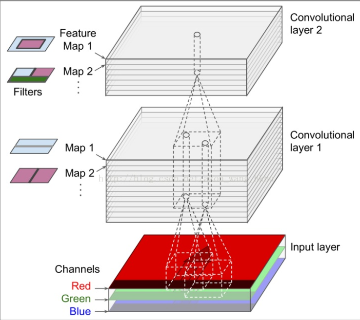
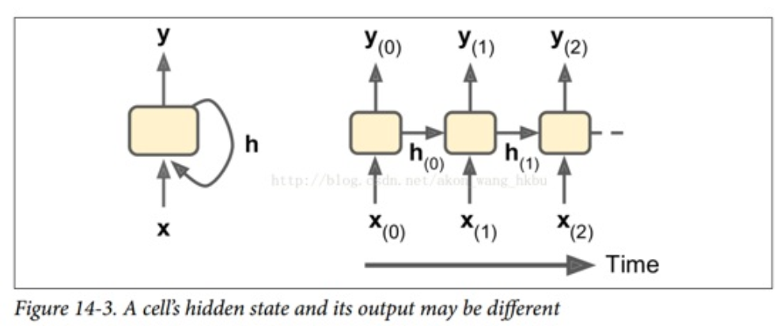
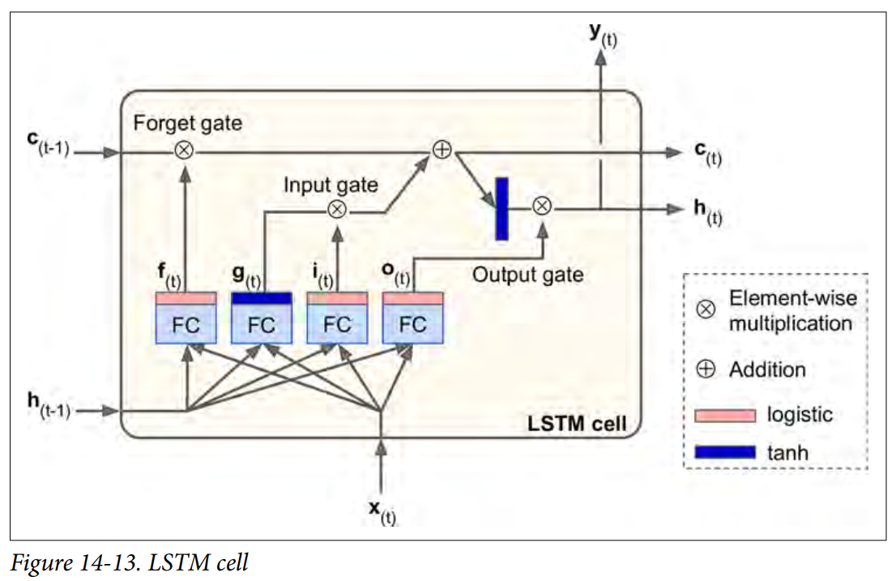
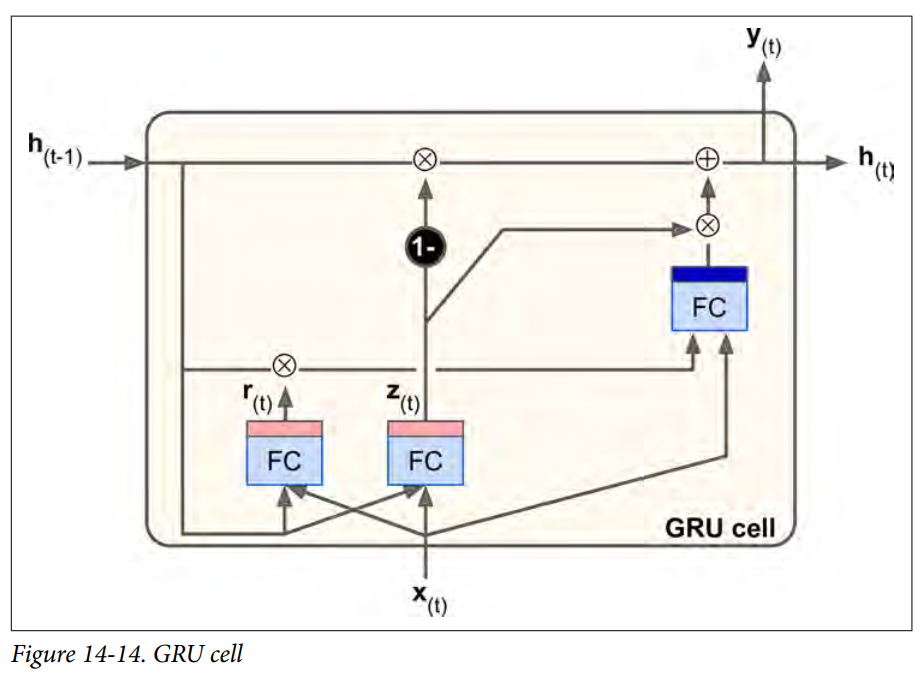
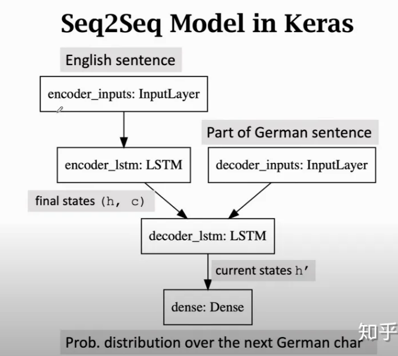
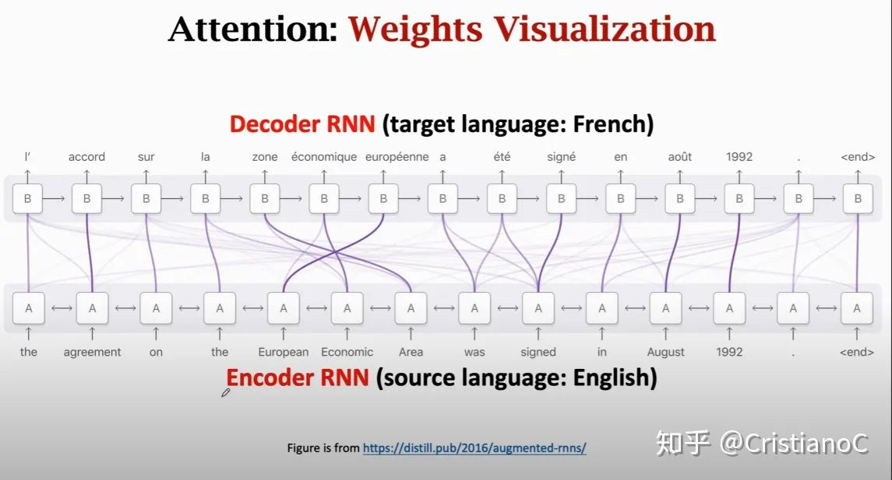

# Hands on Machine Learning with Scrikit Learn and TensorFlow Reading Notes

- [Hands on Machine Learning with Scrikit Learn and TensorFlow Reading Notes](#hands-on-machine-learning-with-scrikit-learn-and-tensorflow-reading-notes)
  - [Fundamental](#fundamental)
    - [Categories](#categories)
    - [Main Challenges](#main-challenges)
    - [No Free Lunch (NFL) Theorem](#no-free-lunch-nfl-theorem)
    - [Online Datasets](#online-datasets)
    - [Example: Housing Price Regression](#example-housing-price-regression)
  - [Classification](#classification)
  - [Regression](#regression)
    - [Polynomial regression](#polynomial-regression)
    - [Bias/Variance trade-off](#biasvariance-trade-off)
    - [Regularized models](#regularized-models)
    - [Logistic Regression](#logistic-regression)
  - [Support Vector Machines](#support-vector-machines)
  - [Decision Trees](#decision-trees)
  - [Ensemble Learning and Random Forests](#ensemble-learning-and-random-forests)
    - [Voting](#voting)
    - [Bagging and Pasting](#bagging-and-pasting)
    - [Random Forest](#random-forest)
    - [Boosting](#boosting)
    - [Stacking](#stacking)
  - [Dimensionality Reduction](#dimensionality-reduction)
    - [Principal Component Analysis (PCA)](#principal-component-analysis-pca)
    - [Manifold](#manifold)
  - [Neural Networks and Deep Learning](#neural-networks-and-deep-learning)
    - [Up and Running with TensorFlow](#up-and-running-with-tensorflow)
      - [Regression Example using TensorFlow](#regression-example-using-tensorflow)
      - [Save and load Model](#save-and-load-model)
      - [Visualize the Graphs](#visualize-the-graphs)
  - [Introduction to Artificial Neural Networks](#introduction-to-artificial-neural-networks)
    - [Hyper-parameter Fine-tuning](#hyper-parameter-fine-tuning)
  - [Training Deep Neural Nets](#training-deep-neural-nets)
    - [Vanishing/Exploding Gradients Problem](#vanishingexploding-gradients-problem)
      - [Initialization](#initialization)
      - [Activation Functions](#activation-functions)
      - [Batch Normalization](#batch-normalization)
      - [Gradient Clipping](#gradient-clipping)
    - [Reusing Pretrained Layers (transfer learning)](#reusing-pretrained-layers-transfer-learning)
    - [Faster Optimizers (Than SGD)](#faster-optimizers-than-sgd)
    - [Avoiding Overfitting Through Regularization](#avoiding-overfitting-through-regularization)
    - [Practical Guidelines](#practical-guidelines)
  - [Convolutional Neural Networks](#convolutional-neural-networks)
    - [Convolutional Layer](#convolutional-layer)
    - [Typical CNN Architectures](#typical-cnn-architectures)
      - [LeNet-5](#lenet-5)
      - [AlexNet](#alexnet)
      - [GoogLeNet](#googlenet)
      - [ResNet](#resnet)
  - [Recurrent Neural Networks](#recurrent-neural-networks)
    - [Recurrent Neurons](#recurrent-neurons)
    - [Memory Cells](#memory-cells)
    - [LSTM](#lstm)
    - [Seq2seq for machine translation](#seq2seq-for-machine-translation)
  - [Autoencoders](#autoencoders)
  - [Reinforcement Learning](#reinforcement-learning)

## Fundamental

### Categories

- Based on human supervision
  - supervised
    - k-Nearest Neighbors
    - Linear Regression
    - Logistic Regression
    - Support Vector Machines (SVMs)
    - Decision Trees and Random Forests
    - Neural networks
  - unsupervised
    - Clustering
      - k-Means
      - Hierarchical Cluster Analysis (HCA)
      - Expectation Maximization
    - Visualization and dimensionality reduction
      - Principal Component Analysis (PCA)
      - Kernel PCA
      - Locally-Linear Embedding (LLE)
      - t-distributed Stochastic Neighbor Embedding (t-SNE)
    - Association rule learning
      - Apriori
      - Eclat
  - semisupervised
    - Deep Belief Networks (DBN)
  - reinforcement learning
    1. Observe
    2. Select action using policy
    3. Action
    4. Get reward or penalty
    5. Update polity (learning step)
    6. Iterate until an optimal policy is found
- Incrementally?
  - online learning (incremental learning)
  - batch learning
- Instance-based or model-based
  - comparing new data points to known data points
  - detect patterns in the training data and build a predictive model

### Main Challenges

- Insufficient Quantity of Training Data (data matters more than algorithms for complex problems)
- Nonrepresentative Training Data
- Poor-Quality Data
- Irrelevant Features, feature engineering involves:
  - Feature selection: selecting the most useful features to train on among existing features.
  - Feature extraction: combining existing features to produce a more useful one.
  - Creating new features by gathering new data.
- Overfitting the Training Data, solutions:
  - To simplify the model by selecting one with fewer parameters, by reducing the number of attributes in the training data or by constraining the model (adjust by tuning regularization hyper-parameters)
  - To gather more training data
  - To reduce the noise in the training data (e.g., fix data errors
  and remove outliers)
- Underfitting the Training Data, solutions:
  - Selecting a more powerful model, with more parameters
  - Feeding better features to the learning algorithm (feature engineering)
  - Reducing the constraints on the model (e.g., reducing the regularization hyper‐parameter)

### No Free Lunch (NFL) Theorem

If you make absolutely no assumption about the data, then there is no reason to prefer one model over any other. [^DW1996]

[^DW1996] The Lack of A Priori Distinctions Between Learning Algorithms, D. Wolperts (1996)

### Online Datasets

- [UC Irvine Machine Learning Repository](http://archive.ics.uci.edu/ml/)
- [Kaggle Dataset](https://www.kaggle.com/datasets)
- [AWS Open Data](https://registry.opendata.aws/)
- [Data Portal](http://dataportals.org/)
- [Open Data Monitor](http://opendatamonitor.eu/)
- [Nasdaq Data Link](https://data.nasdaq.com/)

### Example: Housing Price Regression

``` python
# fetch and load data
%run script/handsonml-houseprice.py
fetch_housing_data()
housing = load_housing_data()

# check housing data
housing.head()
housing.info()
housing.describe()

# check what categories exist and how many districts belong to each category for ocean_proximity column
housing["ocean_proximity"].value_counts()

# plot histogram for each column (feature)
%matplotlib
import matplotlib.pyplot as plt
housing.hist(bins=50, figsize=(20,15))

# split train and test set
train_set, test_set = split_train_test(housing, 0.2)
# or use scikit-learn function to split train test set
from sklearn.model_selection import train_test_split
train_set, test_set = train_test_split(housing, test_size=0.2)
# split median income to 5 categories
housing["income_cat"] = pd.cut(housing["median_income"],
                               bins=[0., 1.5, 3.0, 4.5, 6., np.inf],
                               labels=[1, 2, 3, 4, 5])
# use stratified shuffle splot to make sure train/test set have same distribution on income_cat
from sklearn.model_selection import StratifiedShuffleSplit
split = StratifiedShuffleSplit(n_splits=1, test_size=0.2)
for train_index, test_index in split.split(housing, housing["income_cat"]):
    strat_train_set = housing.loc[train_index]
    strat_test_set = housing.loc[test_index]

# drop labels for training set
data = strat_train_set.drop("median_house_value", axis=1)
data_labels = strat_train_set["median_house_value"].copy()

# fill missing value using sklearn imputer
from sklearn.impute import SimpleImputer
imputer = SimpleImputer(strategy="median")
housing_num = data.drop('ocean_proximity', axis=1) # drop non-number properties
imputer.fit(housing_num)
# transform training set
X = imputer.transform(housing_num)
housing_tr = pd.DataFrame(X, columns=housing_num.columns, index=data.index)

# transform catogorical property to OneHot encoding
from sklearn.preprocessing import OneHotEncoder
cat_encoder = OneHotEncoder(sparse=False)
housing_cat_1hot = cat_encoder.fit_transform(housing_cat)

# number pipeline: fill missing value + add extra feature + normalization
from sklearn.pipeline import Pipeline
from sklearn.preprocessing import StandardScaler
num_pipeline = Pipeline([
        ('imputer', SimpleImputer(strategy="median")),
        ('attribs_adder', FunctionTransformer(add_extra_features, validate=False)),
        ('std_scaler', StandardScaler()),
    ])
# full pipeline: number pipeline + onehot encoder text attributes
from sklearn.compose import ColumnTransformer
num_attribs = list(housing_num)
cat_attribs = ["ocean_proximity"]
full_pipeline = ColumnTransformer([
        ("num", num_pipeline, num_attribs),
        ("cat", OneHotEncoder(), cat_attribs),
    ])
housing_prepared = full_pipeline.fit_transform(data)

# fit random forest
from sklearn.ensemble import RandomForestRegressor
forest_reg = RandomForestRegressor(n_estimators=10)
forest_reg.fit(housing_prepared, housing_labels)
housing_predictions = forest_reg.predict(housing_prepared)
forest_mse = mean_squared_error(housing_labels, housing_predictions)
forest_rmse = np.sqrt(forest_mse) # 21933.31414779769
# cross validation
from sklearn.model_selection import cross_val_score
forest_scores = cross_val_score(forest_reg, housing_prepared, housing_labels,
                                scoring="neg_mean_squared_error", cv=10)
forest_rmse_scores = np.sqrt(-forest_scores)

# use grid search to tune hyper-parameters (or RandomizedSearch for many hyper-parameters)
from sklearn.model_selection import GridSearchCV
param_grid = [
    # try 12 (3×4) combinations of hyperparameters
    {'n_estimators': [3, 10, 30], 'max_features': [2, 4, 6, 8]},
    # then try 6 (2×3) combinations with bootstrap set as False
    {'bootstrap': [False], 'n_estimators': [3, 10], 'max_features': [2, 3, 4]},
  ]
forest_reg = RandomForestRegressor()
# train across 5 folds, that's a total of (12+6)*5=90 rounds of training
grid_search = GridSearchCV(forest_reg, param_grid, cv=5,
                           scoring='neg_mean_squared_error', return_train_score=True)
grid_search.fit(housing_prepared, housing_labels)
grid_search.best_estimator_
```

Ref:

- <http://contrib.scikit-learn.org/category_encoders/#>
- <https://blog.csdn.net/sinat_26917383/article/details/107851162>

Tips: Show all properties of an object in IPython

1. vars(obj) # show all attributes
2. dir(obj)  # show all attributes and methods, including inherited ones
3. help(obj) # show help document

## Classification

``` python
# load MNIST dataset
mnist = load_mnist_dataset()
X, y = mnist.data, mnist.target
# seperate train & test set
from sklearn.model_selection import train_test_split
X_train, X_test, y_train, y_test = train_test_split(mnist.data, mnist.target,
    train_size=60000, test_size=10000)
y_train_n = np.array(list(map(lambda y: int(y), y_train)))
y_test_n = np.array(list(map(lambda y: int(y), y_test)))

# Binary classifier
y_train_5 = (y_train == '5') # True for all 5s, False for all other digits.
y_test_5 = (y_test == '5')
from sklearn.linear_model import SGDClassifier
sgd_clf = SGDClassifier(max_iter=5, tol=-np.infty)
sgd_clf.fit(X_train, y_train_5)
sgd_clf.predict(X_test[:10])
# evaluate
from sklearn.model_selection import cross_val_score
cross_val_score(sgd_clf, X_train, y_train_5, cv=3, scoring="accuracy") # [0.96095, 0.96775, 0.9201]

# Multiple classifier
sgd_clf.fit(X_train, y_train)
sgd_clf.predict(X_test[:10])
cross_val_score(sgd_clf, X_train, y_train, cv=3, scoring="accuracy")

# Normalize X to get better cross validation score
from sklearn.preprocessing import StandardScaler
scaler = StandardScaler()
X_train_scaled = scaler.fit_transform(X_train.astype(np.float64))
cross_val_score(sgd_clf, X_train_scaled, y_train, cv=3, scoring="accuracy")

# Random Forest classifier
from sklearn.ensemble import RandomForestClassifier
forest_clf = RandomForestClassifier()
forest_clf.fit(X_train, y_train)
forest_clf.predict(X_test[:10])
cross_val_score(forest_clf, X_train, y_train, cv=3, scoring="accuracy")
cross_val_score(forest_clf, X_train_scaled, y_train, cv=3, scoring="accuracy")

# Error analysis
y_train_pred = cross_val_predict(sgd_clf, X_train_scaled, y_train, cv=3)
conf_mx = confusion_matrix(y_train, y_train_pred)

# Multiple label classifier
y_train_large = (y_train_n >= 7)
y_train_odd = (y_train_n % 2 == 1)
y_multilabel = np.c_[y_train_large, y_train_odd]
from sklearn.neighbors import KNeighborsClassifier
knn_clf = KNeighborsClassifier()
knn_clf.fit(X_train, y_multilabel)
knn_clf.predict(X_test[:5])
y_train_knn_pred = cross_val_predict(knn_clf, X_train, y_multilabel, cv=3, n_jobs=-1)
f1_score(y_multilabel, y_train_knn_pred, average="macro")

# Multioutput classification
X_train_mod, X_test_mod, y_train_mod, y_test_mod = add_random_noise(X_train, X_test)
knn_clf.fit(X_train_mod, y_train_mod)
clean_digit = knn_clf.predict([X_test_mod[some_index]])
plot_digit(clean_digit)
```

## Regression

Comparison of algorithms for Linear Regression

Algorithm       | Large m | Out-of-core support | Large n | Hyperparams | Scaling required | Scikit-Learn
----------------|---------|---------------------|---------|-------------|------------------|-----------------
Normal Equation | Fast    | No                  | Slow    | 0           | No               | LinearRegression
Batch GD        | Slow    | No                  | Fast    | 2           | Yes              | n/a
Stochastic GD   | Fast    | Yes                 | Fast    | ≥2          | Yes              | SGDRegressor
Mini-batch GD   | Fast    | Yes                 | Fast    | ≥2          | Yes              | n/a

### Polynomial regression

``` python
from sklearn.preprocessing import PolynomialFeatures
poly_features = PolynomialFeatures(degree=2, include_bias=False)
X_poly = poly_features.fit_transform(X) # X_Poly is [X, X^2]

lin_reg = LinearRegression()
lin_reg.fit(X_poly, y)
```

Use learning curve (MSE on training set and validation set) to dignose model:

- Under-fitting: Both curves have reached a plateau; they are close and fairly high;
- Over-fitting: Error on the training data is much lower; gap between the curves (model performs significantly better on the training data than on the validation data)

### Bias/Variance trade-off

A model's generalization error can be expressed as the sum of three very different errors:

1. Bias: This part of the generalization error is due to wrong assumptions, such as assuming that the data is linear when it is actually quadratic. A high-bias model is most likely to underfit the training data.
2. Variance: This part is due to the model's excessive sensitivity to small variations in the training data. A model with many degrees of freedom (such as a high-degree polynomial model) is likely to have high variance, and thus to overfit the training.
data.
3. Irreducible error: This part is due to the noisiness of the data itself. The only way to reduce this part of the error is to clean up the data (e.g., fix the data sources, such as broken sensors, or detect and remove outliers).

### Regularized models

``` python
# Ridge regression
from sklearn.linear_model import Ridge
ridge_reg = Ridge(alpha=1, solver="cholesky")
ridge_reg.fit(X, y)
# Lasso regression
from sklearn.linear_model import Lasso
lasso_reg = Lasso(alpha=0.1)
lasso_reg.fit(X, y)
# ElasticNet
from sklearn.linear_model import ElasticNet
#l1_ratrio is mix rate, r=0 equals ridge regression, r=1 is lasso
elastic_net = ElasticNet(alpha=0.1, l1_ratio=0.5)
elastic_net.fit(X, y)
```

### Logistic Regression

``` python
from sklearn import datasets
iris = datasets.load_iris()
X = iris["data"][:, 3:]  # petal width
y = (iris["target"] == 2).astype(np.int)  # 1 if Iris-Virginica, else 0

from sklearn.linear_model import LogisticRegression
log_reg = LogisticRegression(solver="liblinear")
log_reg.fit(X, y)

# use petal length + petal width to predict if is virginica
X = iris["data"][:, (2, 3)]  # petal length, petal width
y = (iris["target"] == 2).astype(np.int)

log_reg = LogisticRegression(solver="liblinear", C=10**10)
log_reg.fit(X, y)

# use softmax for multi-class classification
X = iris["data"][:, (2, 3)]  # petal length, petal width
y = iris["target"]

softmax_reg = LogisticRegression(multi_class="multinomial",solver="lbfgs", C=10)
softmax_reg.fit(X, y)
```

## Support Vector Machines

``` python
from sklearn.pipeline import Pipeline
from sklearn.preprocessing import StandardScaler
from sklearn.svm import LinearSVC

# linear kernel with soft margin
svm_clf = Pipeline([
        ("scaler", StandardScaler()),
        ("linear_svc", LinearSVC(C=1, loss="hinge")), # smaller C, larger soft margin, generalize better
    ])
svm_clf.fit(X, y)

# add polynomial features
poly_kernel_svm_clf = Pipeline([
        ("scaler", StandardScaler()),
        ("svm_clf", SVC(kernel="poly", degree=3, coef0=1, C=5)) # use grid search to find best degree, coef0 & C
    ])
polynomial_svm_clf.fit(X, y)

# with RBF kernel
rbf_kernel_svm_clf = Pipeline([
        ("scaler", StandardScaler()),
        ("svm_clf", SVC(kernel="rbf", gamma=5, C=0.001))
    ])
rbf_kernel_svm_clf.fit(X, y)
```

Some kernels are specialized for specific data structures. String kernels are sometimes used when classifying text documents or DNA sequences (e.g., using the string subsequence kernel or kernels based on the Levenshtein distance).

Rules for choosing kernel:

- Always try the linear kernel first (remember that LinearSVC is much faster than SVC(kernel="linear")), especially if the training set is very large or if it
has plenty of features.
- If the training set is not too large, you should try the Gaussian RBF kernel as well; it works well in most cases.
- If you have spare time and computing power, you can also experiment with a few other kernels using cross-validation and grid search, especially if there are kernels specialized for your training set's data structure.

Comparison of Scikit-Learn classes for SVM classification

Class         | Time complexity        | Out-of-core support | Scaling required | Kernel trick
--------------|------------------------|---------------------|------------------|-------------
LinearSVC     | O(m * n)               | No                  | Yes              | No
SGDClassifier | O(m * n)               | Yes                 | Yes              | No
SVC           | O(m² × n) to O(m³ * n) | No                  | Yes              | Yes

``` python
# Support Vector Regression
from sklearn.svm import LinearSVR

svm_reg = LinearSVR(epsilon=1.5) # bigger epsilon, wider gap
svm_reg.fit(X, y)

# non-linear core
svm_poly_reg1 = SVR(kernel="poly", degree=2, C=100, epsilon=0.1, gamma="auto")
svm_poly_reg2 = SVR(kernel="poly", degree=2, C=0.01, epsilon=0.1, gamma="auto")
svm_poly_reg1.fit(X, y)
svm_poly_reg2.fit(X, y)
# bigger C, lesser regulation
```

## Decision Trees

``` python
from sklearn.tree import DecisionTreeClassifier
tree_clf = DecisionTreeClassifier(max_depth=2)
tree_clf.fit(X, y)
tree_clf.predict([[5, 1.5]])
```

Each node has an 'impurity' property (gini), a node is "pure" (gini=0) if all training instances it applies to belong to the same class. By default, the Gini impurity measure is used, but you can select the entropy impurity measure instead by setting the criterion hyperparameter to "entropy".

``` python
# Decision Tree Regressor
from sklearn.tree import DecisionTreeRegressor

tree_reg = DecisionTreeRegressor(max_depth=2)
tree_reg.fit(X, y)
```

- Pro: simple to understand and interpret
- Con: very sensitive to small variations in the training data

## Ensemble Learning and Random Forests

### Voting

Ensemble methods work best when the predictors are as independent from one another as possible. One way to get diverse classifiers is to train them using very different algorithms. This increases the chance that they will make very different types of errors, improving the ensemble's accuracy.

``` python
# Voting Classifier
from sklearn.ensemble import RandomForestClassifier
from sklearn.ensemble import VotingClassifier
from sklearn.linear_model import LogisticRegression
from sklearn.svm import SVC

log_clf = LogisticRegression(solver="liblinear")
rnd_clf = RandomForestClassifier(n_estimators=10)
svm_clf = SVC(gamma="auto", probability=True)

voting_clf = VotingClassifier(
    estimators=[('lr', log_clf), ('rf', rnd_clf), ('svc', svm_clf)],
    voting='soft')
voting_clf.fit(X_train, y_train)
```

### Bagging and Pasting

Bagging & pasting use the same training algorithm for every predictor, but to train them on different random subsets of the training set. When sampling is performed with replacement, this method is called bagging1 (short for bootstrap aggregating). When sampling is performed without replacement, it is called pasting.

``` python
from sklearn.ensemble import BaggingClassifier
from sklearn.tree import DecisionTreeClassifier

bag_clf = BaggingClassifier(
    DecisionTreeClassifier(),
    n_estimators=500, max_samples=100, # 500 classifiers, each trained uses 100 samples
    bootstrap=True, # Bagging: bootstrap=True, Pasting: bootstrap=False
    n_jobs=-1) # n_jobs, number of CPU cores to use for training, -1 means all cores
    #
bag_clf.fit(X_train, y_train)
y_pred = bag_clf.predict(X_test)

# Out-Of-Bag (OOB) evaluation
bag_clf = BaggingClassifier(
    DecisionTreeClassifier(splitter="random", max_leaf_nodes=16),
    n_estimators=500, max_samples=1.0, bootstrap=True, n_jobs=-1,
    oob_score=True) # use each classifier's oob samples for evalation
bag_clf.fit(X_train, y_train)
bag_clf.oob_score_
```

The BaggingClassifier class supports sampling the features as well. This is controlled by two hyperparameters: `max_features` and `bootstrap_features`.

### Random Forest

``` python
from sklearn.ensemble import RandomForestClassifier

rnd_clf = RandomForestClassifier(n_estimators=500, max_leaf_nodes=16, n_jobs=-1)
rnd_clf.fit(X_train, y_train)

y_pred_rf = rnd_clf.predict(X_test)

# Extremely Randomized Trees
from sklearn.ensemble import ExtraTreesClassifier

ert_clf = ExtraTreesClassifier(n_estimators=500, max_leaf_nodes=16, n_jobs=-1)
ert_clf.fit(X_train, y_train)
```

On a signle Decision Tree, important features are likely to appear closer to the root of the tree, while unimportant features will often appear closer to the leaves (or not at all). We can check each features importance using `feature_importances_` property.

### Boosting

- AdaBoost (Adaptive Boosting): For each iteration, a predictor's weight is adjusted by its accuracy on training set (more accurate, higher weight), an instance's weight is lifted if it is mis-classified. The algorithm stops when the desired number of predictors is reached, or when a perfect predictor is found.
- Gradient Boosting: Fit the new predictor to the *residual errors* made by the previous predictor.

``` python
# AdaBoost
from sklearn.ensemble import AdaBoostClassifier

ada_clf = AdaBoostClassifier(
    DecisionTreeClassifier(max_depth=1), n_estimators=200,
    algorithm="SAMME.R", learning_rate=0.5)
ada_clf.fit(X_train, y_train)

# Gradient Boosting
from sklearn.ensemble import GradientBoostingRegressor

gbrt = GradientBoostingRegressor(max_depth=2, n_estimators=3, learning_rate=1.0)
gbrt.fit(X, y)
```

### Stacking

Use hold out set to train blender, use blender instead of simple voting.

Open source implementation [brew](https://github.com/viisar/brew)

## Dimensionality Reduction

Curse of dimensionality: High dimensional datasets are at risk of being very sparse: most training instances are likely to be far away from each other. The more dimensions the training set has, the greater the risk of overfitting it.

- Projection: project every training instance perpendicularly onto lower dimension subspace
- Manifold Learning: a 2D manifold is a 2D shape that can be bent and twisted in a higher-dimensional space. More generally, a d-dimensional manifold is a part of an n-dimensional space (where d < n) that locally resembles a d-dimensional hyperplane.

Manifold hypothesis: most real-world high-dimensional datasets lie close to a much lower-dimensional manifold.

Reduce dimensionality before training:

1. definitely speed up training;
2. may not always lead to a better or simpler solution; it all depends on the dataset.

### Principal Component Analysis (PCA)

``` python
# use Numpy SVD (Singular Value Decomposition) function to calculate PCA
X_centered = X - X.mean(axis=0) # don't forget to center the data first
U, s, Vt = np.linalg.svd(X_centered)
# X decomposed into dot production of 3 matrices
# X = U · Σ · VT, VT contains all the principal components
c1 = Vt.T[:, 0]  # first principle component
c2 = Vt.T[:, 1]  # second PC
# projects X onto first two principal components plane
W2 = Vt.T[:,:2]
X2D_svd = X_centered.dot(W2)

# use scikit learn PCA class
from sklearn.decomposition import PCA

pca = PCA(n_components = 0.95) # auto select min components to reserve 95% variance
X2D_pca = pca.fit_transform(X)

# get PCA components & explained variance ratio
pca.components_
pca.explained_variance_ratio_
# recover 3D points
X3D_inv = pca.inverse_transform(X2D_pca)

# Use incremental PCA when whole dataset is big
from sklearn.decomposition import IncrementalPCA
n_batches = 100
inc_pca = IncrementalPCA(n_components = 154)
for X_batch in np.array_split(X_mnist, n_batches):
    inc_pca.partial_fit(X_batch)
X_mnist_reduced = inc_pca.transform(X_mnist)

# randomized PCA (much faster)
rnd_pca = PCA(n_components = 154, svd_solver = 'randomized')
X_reduced = rnd_pca.fit_transform(X_mnist)

# use RBF kernel PCA
from sklearn.decomposition import KernelPCA
rbf_pca = KernelPCA(n_components = 2, kernel = 'rbf', gamma = 0.04)
X_reduced = rbf_pca.fit_transform(X)
# other kernels
lin_pca = KernelPCA(n_components = 2, kernel = "linear", fit_inverse_transform = True)
rbf_pca = KernelPCA(n_components = 2, kernel = "rbf", gamma = 0.0433, fit_inverse_transform = True)
sig_pca = KernelPCA(n_components = 2, kernel = "sigmoid", gamma = 0.001, coef0 = 1, fit_inverse_transform = True)
```

### Manifold

Locally Linear Embedding (LLE) first measures how each training instance linearly relates to its closest neighbors (c.n.), and then looks for a low-dimensional representation of the training set where these local relationships are best preserved.

``` python
# create swiss roll data set
from sklearn.datasets import make_swiss_roll
X, t = make_swiss_roll(n_samples = 1000, noise = 0.2)

# LLE: Locally Linear Embedding
from sklearn.manifold import LocallyLinearEmbedding
lle = LocallyLinearEmbedding(n_components = 2, n_neighbors = 10)
X_reduced = lle.fit_transform(X)

# MDS: Multidimensional Scaling
from sklearn.manifold import MDS
mds = MDS(n_components = 2)
X_reduced_mds = mds.fit_transform(X)

# Isomap: preserve geodesic distances between instances
from sklearn.manifold import Isomap
isomap = Isomap(n_components = 2)
X_reduced_isomap = isomap.fit_transform(X)

# t-Distributed Stochastic Neighbor Embedding
from sklearn.manifold import TSNE
tsne = TSNE(n_components = 2)
X_reduced_tsne = tsne.fit_transform(X)

# Linear Discriminant Analysis
from sklearn.discriminant_analysis import LinearDiscriminantAnalysis
lda = LinearDiscriminantAnalysis(n_components = 2)
X_mnist = mnist["data"]
y_mnist = mnist["target"]
lda.fit(X_mnist, y_mnist)
X_reduced_lda = lda.transform(X_mnist)
```

## Neural Networks and Deep Learning

### Up and Running with TensorFlow

``` python
# tensorflow 1.0
import tensorflow as tf
x = tf.Variable(3, name="x")
y = tf.Variable(4, name="y")
f = x*x*y + y + 2

sess = tf.Session()
sess.run(x.initializer)
sess.run(y.initializer)
result = sess.run(f)

print(result)

# run v1.0 style code under 2.0
import tensorflow.compat.v1 as tf
tf.disable_eager_execution()
tf.disable_v2_behavior()

# tensorflow 2.0
import tensorflow as tf
x = tf.constant(3)
y = tf.constant(4)
f = x*x*y + y + 2
print('x = {0}, y = {1}, f={2}'.format(x, y, f))
```

Ref:

- <https://tensorflow.google.cn/guide/migrate/migrate_tf2?hl=zh-cn>
- <https://blog.csdn.net/lxj1435359352/article/details/111350201>
- <https://tensorflow.google.cn/guide/upgrade?hl=zh-CN>

#### Regression Example using TensorFlow

``` python
# build model with 2 hidden layers (64 neurons each with relu activation) and 1 output layer
def build_model():
  model = keras.Sequential([
    layers.Dense(64, activation='relu', input_shape=[len(train_dataset.keys())]),
    layers.Dense(64, activation='relu'),
    layers.Dense(1)
  ])

  optimizer = tf.keras.optimizers.RMSprop(0.001)

  model.compile(loss='mse',
                optimizer=optimizer,
                metrics=['mae', 'mse'])
  return model

model = build_model()
model.summary()

# set early stop callback
early_stop = keras.callbacks.EarlyStopping(monitor='val_loss', patience=10)

# train model
history = model.fit(normed_train_data, train_labels, epochs=EPOCHS,
                    validation_split = 0.2, verbose=0, callbacks=[early_stop, PrintDot()])

# evaluation
loss, mae, mse = model.evaluate(normed_test_data, test_labels, verbose=2)

# prediction
test_predictions = model.predict(normed_test_data).flatten()
```

Ref: <https://tensorflow.google.cn/tutorials/keras/regression?hl=zh-cn>

#### Save and load Model

``` python
def create_model():
  model = tf.keras.Sequential([
    keras.layers.Dense(512, activation='relu', input_shape=(784,)),
    keras.layers.Dropout(0.2),
    keras.layers.Dense(10)
  ])

  model.compile(optimizer='adam',
                loss=tf.keras.losses.SparseCategoricalCrossentropy(from_logits=True),
                metrics=[tf.keras.metrics.SparseCategoricalAccuracy()])

  return model

# Create a basic model instance
model = create_model()

# Use checkpoints to save during training
checkpoint_path = "training_1/cp.ckpt"
checkpoint_dir = os.path.dirname(checkpoint_path)

# Create a callback that saves the model's weights
cp_callback = tf.keras.callbacks.ModelCheckpoint(filepath=checkpoint_path,
                                                 save_weights_only=True,
                                                 verbose=1)

# Train the model with the new callback
model.fit(train_images,
          train_labels,
          epochs=10,
          validation_data=(test_images, test_labels),
          callbacks=[cp_callback])  # Pass callback to training

# create a new model with same structure
model = create_model()

# Loads the weights
model.load_weights(checkpoint_path)

# Manually save and load weights
model.save_weights('./checkpoints/my_checkpoint')
model = create_model()
model.load_weights('./checkpoints/my_checkpoint')

# Save the entire model as a SavedModel.
model.save('saved_model/my_model')

# Reload the model without accessing original create_model() method
new_model = tf.keras.models.load_model('saved_model/my_model')

# Check its architecture
new_model.summary()

# Save the entire model to a HDF5 file.
# The '.h5' extension indicates that the model should be saved to HDF5.
model.save('my_model.h5')
```

HDF5 和 SavedModel 之间的主要区别在于，HDF5 使用对象配置来保存模型架构，而 SavedModel 则保存执行计算图。因此，SavedModel 能够在不需要原始代码的情况下保存自定义对象，如子类模型和自定义层。

Ref: <https://tensorflow.google.cn/tutorials/keras/save_and_load?hl=zh-cn>

#### Visualize the Graphs

``` python
# Load the TensorBoard notebook extension
%load_ext tensorboard

model = create_model()
model.compile(optimizer='adam',
              loss='sparse_categorical_crossentropy',
              metrics=['accuracy'])

log_dir = "logs/fit/" + datetime.datetime.now().strftime("%Y%m%d-%H%M%S")
tensorboard_callback = tf.keras.callbacks.TensorBoard(log_dir=log_dir, histogram_freq=1)

model.fit(x=x_train,
          y=y_train,
          epochs=5,
          validation_data=(x_test, y_test),
          callbacks=[tensorboard_callback])

# Launch TensorBoard
%tensorboard --logdir logs/fit

# Upload to TensorBoard.dev
!tensorboard dev upload \
  --logdir logs/fit \
  --name "(optional) My latest experiment" \
  --description "(optional) Simple comparison of several hyperparameters" \
  --one_shot
```

Ref:

- <https://tensorflow.google.cn/guide/intro_to_graphs?hl=zh-cn>
- <https://tensorflow.google.cn/tensorboard?hl=zh-cn>

## Introduction to Artificial Neural Networks

Ref:

- <https://tensorflow.google.cn/api_docs/python/tf/estimator/DNNClassifier>
- <https://tensorflow.google.cn/guide/migrate/canned_estimators?hl=zh-cn>
- <https://tensorflow.google.cn/guide/keras/rnn?hl=zh-cn>

Estimators are not recommended for new code. Estimators run v1.Session-style code which is more difficult to write correctly, and can behave unexpectedly, especially when combined with TF 2 code.

Estimators Migration

TensorFlow 1                                                   | TensorFlow 2
---------------------------------------------------------------|--------------------------------------------
tf.estimator.LinearEstimator, Classifier, Regressor            | Keras tf.compat.v1.keras.models.LinearModel
tf.estimator.DNNEstimator, Classifier, Regressor               | 自定义 Keras DNN ModelKeras
tf.estimator.DNNLinearCombinedEstimator, Classifier, Regressor | tf.compat.v1.keras.models.WideDeepModel
tf.estimator.BoostedTreesEstimato, Classifier, Regressor       | tfdf.keras.GradientBoostedTreesModel

``` python
# v1
estimator = tf.estimator.DNNClassifier(
    feature_columns=[sparse_feature_a_emb, sparse_feature_b_emb],
    hidden_units=[1024, 512, 256],
    optimizer=tf.train.ProximalAdagradOptimizer(
      learning_rate=0.1,
      l1_regularization_strength=0.001
    ))
# v2
dnn_model = tf.keras.models.Sequential([
    tf.keras.layers.Dense(1024, activation='relu'),
    tf.keras.layers.Dense(512, activation='relu'),
    tf.keras.layers.Dense(256, activation='relu'),
    tf.keras.layers.Dense(10, activation='softmax')
])

```

### Hyper-parameter Fine-tuning

Combination of hyperparameters:

- number of layers
- number of neurons per layer
- type of activation function to use in each layer
- weight initialization logic

Tools:

- Random Search
- [Oscar](http://oscar.calldesk.ai/)

Tips:

1. Number of hidden layers:
    - an MLP with just one hidden layer can model even the most complex functions provided it has enough neurons.
    - deep networks have a much higher parameter efficiency than shallow ones: they can model complex functions using exponentially fewer neurons than shallow nets, making them much faster to train.
    - it is much more common to reuse parts of a pretrained state-of-the-art network that performs a similar task.
Training will be a lot faster and require much less data
2. Number of Neurons per Hidden Layer
    - number of neurons in the input and output layers is determined by the type of input and output your task requires.
    - for the hidden layers, a common practice is to size them to form a funnel, with fewer and fewer neurons at each layer—the rationale being that many low-level features can coalesce into far fewer high-level features.
    - pick a model with more layers and neurons than you actually need, then use early stopping to prevent it from overfitting (and other regularization techniques, especially dropout).
3. Activation Functions
    - In most cases you can use the ReLU activation function in the hidden layers (or one of its variants).
    - For the output layer, the softmax activation function is generally a good choice for classification tasks (when the classes are mutually exclusive).
    - For regression tasks, you can simply use no activation function at all.

## Training Deep Neural Nets

### Vanishing/Exploding Gradients Problem

- Vanishing gradients problem: lower layer connection weights virtually unchanged.
- Exploding gradients problem: many layers get insanely large weight updates and the algorithm diverges.

#### Initialization

Understanding the Difficulty of Training Deep Feedforward Neural Networks, by Xavier Glorot & Yoshua Bengio.

- Weights initialization: Xavier initialization (when using logistic activation function)
- ReLU activation function and its variants.

``` python
# https://keras.io/zh/initializers/
keras.initializers.RandomNormal(mean=0.0, stddev=0.05, seed=None)
keras.initializers.RandomUniform(minval=-0.05, maxval=0.05, seed=None)
keras.initializers.TruncatedNormal(mean=0.0, stddev=0.05, seed=None)
keras.initializers.VarianceScaling(scale=1.0, mode='fan_in', distribution='normal', seed=None)
keras.initializers.lecun_normal(seed=None)
keras.initializers.lecun_uniform(seed=None)
keras.initializers.glorot_normal(seed=None)
keras.initializers.glorot_uniform(seed=None)
keras.initializers.he_normal(seed=None)
keras.initializers.he_uniform(seed=None)
```

#### Activation Functions

Activation function | Uniform distribution [-r,r]                          | Normal distribution
--------------------|------------------------------------------------------|----------------------------------------------------------
Logistic            | $r=\sqrt{\cfrac{6}{n_{inputs}+n_{outputs}}}$         | $\sigma=\sqrt{\cfrac{2}{n_{inputs}+n_{outputs}}}$
Hyperbolic tangent  | $r=4\sqrt{\cfrac{6}{n_{inputs}+n_{outputs}}}$        | $\sigma=4\sqrt{\cfrac{2}{n_{inputs}+n_{outputs}}}$
ReLU (and variants) | $r=\sqrt{2}\sqrt{\cfrac{6}{n_{inputs}+n_{outputs}}}$ | $\sigma=\sqrt{2}\sqrt{\cfrac{2}{n_{inputs}+n_{outputs}}}$

Dying ReLUs: during training, some neurons effectively die, meaning
they stop outputting anything other than 0.

- ReLU: $R(z)=max(0, z)$
- Leaky ReLU: $R(z)=max(\alpha z, z)$ ($\alpha$ is usually 0.01)
- PReLU (Parameterized ReLU): $\alpha$ as a hyperparameter
- ELU (Exponential Linear Unit):
  $ELU_{\alpha}(z) = \begin{cases}
    \alpha (exp(z)=1) &\text{if } z < 0 \\
    z &\text{if } x \ge 0
  \end{cases}$

Ref: <https://zhuanlan.zhihu.com/p/172254089>

``` python
# specify activation function when adding model layer
from keras.layers import Activation, Dense
model.add(Dense(64, activation='tanh'))
# Predefined activation functions in TensorFlow
# https://keras.io/zh/activations/
keras.activations.softmax(x, axis=-1)
keras.activations.elu(x, alpha=1.0)
keras.activations.selu(x)
keras.activations.softplus(x)
keras.activations.softsign(x)
keras.activations.relu(x, alpha=0.0, max_value=None, threshold=0.0)
keras.activations.tanh(x)
sigmoid(x)
hard_sigmoid(x)
keras.activations.exponential(x)
keras.activations.linear(x)
# https://keras.io/zh/layers/advanced-activations/
keras.layers.LeakyReLU(alpha=0.3)
keras.layers.PReLU(alpha_initializer='zeros', alpha_regularizer=None, alpha_constraint=None, shared_axes=None)
keras.layers.ELU(alpha=1.0)
keras.layers.ThresholdedReLU(theta=1.0)
keras.layers.Softmax(axis=-1)
keras.layers.ReLU(max_value=None, negative_slope=0.0, threshold=0.0)
```

#### Batch Normalization

The technique consists of adding an operation in the model just before the activation function of each layer, simply zero-centering and normalizing the inputs, then scaling and shifting the result using two new parameters per layer (one for scaling, the other for shifting). In other words, this operation lets the model learn the optimal scale and mean of the inputs for each layer.

``` python
tf.layers.batch_normalization(
    inputs, axis=-1, momentum=0.99, epsilon=0.001, center=True, scale=True,
    beta_initializer=tf.zeros_initializer(),
    gamma_initializer=tf.ones_initializer(),
    moving_mean_initializer=tf.zeros_initializer(),
    moving_variance_initializer=tf.ones_initializer(), beta_regularizer=None,
    gamma_regularizer=None, beta_constraint=None, gamma_constraint=None,
    training=False, trainable=True, name=None, reuse=None, renorm=False,
    renorm_clipping=None, renorm_momentum=0.99, fused=None, virtual_batch_size=None,
    adjustment=None
)
```

Ref:

- <https://zhuanlan.zhihu.com/p/360842139>
- <https://www.zhihu.com/question/53133249/answer/177584985>

#### Gradient Clipping

``` python
from keras import optimizers
sgd = optimizers.SGD(lr=0.01, clipnorm=1.)
```

Ref:

- <https://zhuanlan.zhihu.com/p/112904260>
- <https://cloud.tencent.com/developer/article/1572036>

### Reusing Pretrained Layers (transfer learning)

``` python
# load model with same structure
model.save("my_model")
reconstructed_model = keras.models.load_model("my_model")

# Saving & loading only the model's weights values
# Copy weights from functional_model to subclassed_model.
subclassed_model.set_weights(functional_model.get_weights())

# Example: load weights from pretrained model
def create_functional_model():
    inputs = keras.Input(shape=(784,), name="digits")
    x = keras.layers.Dense(64, activation="relu", name="dense_1")(inputs)
    x = keras.layers.Dense(64, activation="relu", name="dense_2")(x)
    outputs = keras.layers.Dense(10, name="predictions")(x)
    return keras.Model(inputs=inputs, outputs=outputs, name="3_layer_mlp")

functional_model = create_functional_model()
functional_model.save_weights("pretrained_weights.h5")

# In a separate program:
pretrained_model = create_functional_model()
pretrained_model.load_weights("pretrained_weights.h5")

# Create a new model by extracting layers from the original model:
extracted_layers = pretrained_model.layers[:-1]
extracted_layers.append(keras.layers.Dense(5, name="dense_3"))
model = keras.Sequential(extracted_layers)
model.summary()

# BatchNormalization layer has 2 trainable weights and 2 non-trainable weights
layer = keras.layers.BatchNormalization()
layer.build((None, 4))  # Create the weights
print("weights:", len(layer.weights)) # 4
print("trainable_weights:", len(layer.trainable_weights)) # 2
print("non_trainable_weights:", len(layer.non_trainable_weights)) # 2

layer = keras.layers.Dense(3)
layer.build((None, 4))  # Create the weights
layer.trainable = False  # Freeze the layer

# Make a model with 2 layers
layer1 = keras.layers.Dense(3, activation="relu")
layer2 = keras.layers.Dense(3, activation="sigmoid")
model = keras.Sequential([keras.Input(shape=(3,)), layer1, layer2])

# Freeze the first layer
layer1.trainable = False

# Keep a copy of the weights of layer1 for later reference
initial_layer1_weights_values = layer1.get_weights()

# Train the model
model.compile(optimizer="adam", loss="mse")
model.fit(np.random.random((2, 3)), np.random.random((2, 3)))

# Check that the weights of layer1 have not changed during training
final_layer1_weights_values = layer1.get_weights()
np.testing.assert_allclose(
    initial_layer1_weights_values[0], final_layer1_weights_values[0]
)
np.testing.assert_allclose(
    initial_layer1_weights_values[1], final_layer1_weights_values[1]
)
```

Ref:

- <https://tensorflow.google.cn/guide/keras/save_and_serialize>
- <https://tensorflow.google.cn/guide/keras/transfer_learning>

- [TensorFlow Model Garden](https://github.com/tensorflow/models)
- [PyTorch Vision Pretrained Models](https://pytorch.org/vision/stable/models.html)
- [PyTorch Github](https://github.com/pytorch/vision/tree/main/torchvision/models)

### Faster Optimizers (Than SGD)

- Momentum Optimization: the gradient is used as an acceleration, not as a speed.
- Nesterov Accelerated Gradient: measure the gradient of the cost function not at the local position but slightly ahead in the direction of the momentum.
- AdaGrad: scaling down the gradient vector along the steepest dimensions with adaptive learning rate (often stops too early when training neural networks).
- RMSProp: accumulating only the gradients from the most recent iterations (as opposed to all the gradients since the beginning of training)
- Adam Optimization (recommended): adaptive moment estimation, combines the ideas of Momentum optimization and RMSProp

``` python
# AdamOptimizer
# suggest to user default parameters:
# keras.optimizers.Adam(lr=0.001, beta_1=0.9, beta_2=0.999, epsilon=None, decay=0.0, amsgrad=False)
adam = tf.keras.optimizers.Adam(learning_rate=0.01)
model.compile(optimizer=adam)
# or specify optimizer by name (using default optimizer parameters)
model.compile(optimizer='adam')
# NAdam
# keras.optimizers.Nadam(lr=0.002, beta_1=0.9, beta_2=0.999, epsilon=None, schedule_decay=0.004)
```

Ref:

- <https://keras.io/zh/optimizers/>
- <https://tensorflow.google.cn/api_docs/python/tf/keras/optimizers/Adam>
- <https://blog.csdn.net/weixin_49346755/article/details/124526270>

### Avoiding Overfitting Through Regularization

- Early stopping
- L1 & L2 regulation
- Dropout
- Max-Norm Regularization
- Data Augmentation

``` python
# L1 & L2 regulation
from keras import regularizers
l2_model = tf.keras.Sequential([
    layers.Dense(512, activation='elu',
                 kernel_regularizer=regularizers.l2(0.001),
                 input_shape=(FEATURES,)),
    layers.Dense(512, activation='elu',
                 kernel_regularizer=regularizers.l2(0.001)),
    layers.Dense(512, activation='elu',
                 kernel_regularizer=regularizers.l2(0.001)),
    layers.Dense(512, activation='elu',
                 kernel_regularizer=regularizers.l2(0.001)),
    layers.Dense(1)
])
regularizer_histories['l2'] = compile_and_fit(l2_model, "regularizers/l2")

# Dropout
dropout_model = tf.keras.Sequential([
    layers.Dense(512, activation='elu', input_shape=(FEATURES,)),
    layers.Dropout(0.5),
    layers.Dense(512, activation='elu'),
    layers.Dropout(0.5),
    layers.Dense(512, activation='elu'),
    layers.Dropout(0.5),
    layers.Dense(512, activation='elu'),
    layers.Dropout(0.5),
    layers.Dense(1)
])
regularizer_histories['dropout'] = compile_and_fit(dropout_model, "regularizers/dropout")
# The resulting neural network can be seen as an averaging ensemble of all these smaller neural networks.
```

Ref:

- <https://keras.io/zh/regularizers/>
- <https://tensorflow.google.cn/tutorials/keras/overfit_and_underfit>

### Practical Guidelines

Default DNN configuration

- Initialization: He initialization
- Activation function: ELU
- Normalization: Batch Normalization
- Regularization: Dropout
- Optimizer: Adam
- Learning rate schedule: None

## Convolutional Neural Networks

### Convolutional Layer

- Receptive field: A neuron located in row i, column j of a given layer is connected to the outputs of the neurons in the previous layer located in rows i to $i + f_h – 1$, columns j to $j + f_w – 1$, where $f_h$ and $f_w$ are the height and width of the receptive field
- Zero padding: add zeros around the inputs in order for a layer to have the same height and width as the previous layer
- Stride: The distance between two consecutive receptive fields
- Filter: A neuron's weights can be represented as a small image the size of the receptive field.
- Feature map: a layer full of neurons using the same filter highlights the areas in an image that are most similar to the filter. During training, a CNN finds the most useful filters for its task, and it learns to combine them into more complex patterns.
- Stacking Multiple Feature Maps: a convolutional layer simultaneously applies multiple filters to its inputs, making it capable of detecting multiple features anywhere in its inputs.



``` python
# https://tensorflow.google.cn/api_docs/python/tf/keras/layers/Conv2D
tf.keras.layers.Conv2D(
    filters,
    kernel_size,
    strides=(1, 1),
    padding='valid',
    data_format=None,
    dilation_rate=(1, 1),
    groups=1,
    activation=None,
    use_bias=True,
    kernel_initializer='glorot_uniform',
    bias_initializer='zeros',
    kernel_regularizer=None,
    bias_regularizer=None,
    activity_regularizer=None,
    kernel_constraint=None,
    bias_constraint=None,
    **kwargs
)
# https://tensorflow.google.cn/api_docs/python/tf/keras/layers/MaxPool2D
tf.keras.layers.MaxPool2D(
    pool_size=(2, 2),
    strides=None,
    padding='valid',
    data_format=None,
    **kwargs
)
# https://tensorflow.google.cn/api_docs/python/tf/keras/layers/AveragePooling2D
tf.keras.layers.AveragePooling2D(
    pool_size=(2, 2),
    strides=None,
    padding='valid',
    data_format=None,
    **kwargs
)
```

### Typical CNN Architectures

- Input
- Convolution(+ReLU)
- Pooling
- Convolution(+ReLU)
- Pooling
- Fully connected
- Output

#### LeNet-5

Created by Yann LeCun in 1998 and widely used for handwritten digit recognition (MNIST)

Layer|Type|Map|Size|Kernel size|Stride|Activation
-|-|-|-|-|-|-
Out|Fully Connected|-|10|-|-|RBF
F6|Fully Connected|-|84|-|-|tanh
C5|Convolution|120|1x1|5x5|1|tanh
S4|Avg Pooling|16|5x5|2x2|2|tanh
C3|Convolution|16|10x10|5x5|1|tanh
S2|Avg Pooling|6|14x14|2x2|2|tanh
C1|Convolution|6|28x28|5x5|1|tanh
In|Input|1|32x32|-|-|-

#### AlexNet

Layer|Type|Map|Size|Kernel size|Stride|Padding|Activation
-|-|-|-|-|-|-|-
Out|Fully Connected|-|1000|-|-|-|Softmax
F9|Fully Connected|-|4096|-|-|-|ReLU
F8|Fully Connected|-|4096|-|-|-|ReLU
C7|Convolution|256|13x13|3x3|1|SAME|ReLU
C6|Convolution|384|13x13|3x3|1|SAME|ReLU
C5|Convolution|384|13x13|3x3|1|SAME|ReLU
S4|Max Pooling|256|13x13|3x3|2|VALID|-
C3|Convolution|256|27x27|5x5|1|SAME|ReLU
S2|Max Pooling|96|27x27|3x3|2|VALID|-
C1|Convolution|96|55x55|11x11|4|SAME|ReLU
In|Input|3 (RGB)|224x224|-|-|-|-

Local response normalization: makes the neurons that most strongly activate inhibit neurons at the same location but in neighboring feature maps. This encourages different feature maps to specialize, pushing them apart and forcing them to explore a wider range of features, ultimately improving generalization.

<https://tensorflow.google.cn/api_docs/python/tf/nn/local_response_normalization>

#### GoogLeNet

inception modules, 6 million parameters

#### ResNet

152 layers, skip connection

## Recurrent Neural Networks

### Recurrent Neurons

At each time step $t$, every neuron receives both the input vector $x_{(t)}$ and the output vector from the previous time step $y_{(t–1)}$.

$$y_{(t)} = \phi( {x_{(t)}}^T \cdot w_x + {y_{(t-1)}}^T \cdot w_y + b )$$

- weight vectors: $w_x$, $w_y$
- activation function (e.g. ReLU): $\phi()$
- bias term: $b$

### Memory Cells

A part of a neural network that preserves some state across time steps is called a memory cell (or simply a cell). A cell's state at time step $t$, denoted $h_{(t)}$ (h stands for hidden), is a function of inputs at that time step and its state at the previous time step: $h_{(t)} = f(h_{(t–1)}, x_{(t)})$



- sequence to sequence: predicting time series such as stock prices
- sequence to vector (ignore output except last one): give a movie review a sentiment score
- vector to sequence (single input), input a image, output a caption
- sequence to vector (encoder) + vector to sequence (decoder): translation to another language

Ref: <https://tensorflow.google.cn/guide/keras/rnn>

``` python
model = keras.Sequential()
# Add an Embedding layer expecting input vocab of size 1000, and
# output embedding dimension of size 64.
model.add(layers.Embedding(input_dim=1000, output_dim=64))
# Add a LSTM layer with 128 internal units.
model.add(layers.LSTM(128))
# Add a Dense layer with 10 units.
model.add(layers.Dense(10))
model.summary()
```

To train an RNN, the trick is to unroll it through time (like we just did) and then simply use regular backpropagation (see Figure 14-5). This strategy is called backpropagation through time (BPTT).

``` python
# create model
model = tf.keras.Sequential([
    tf.keras.layers.Embedding(encoder.vocab_size, 64),       # text index to vector
    tf.keras.layers.Bidirectional(tf.keras.layers.LSTM(64)), # RNN layer
    tf.keras.layers.Dense(64, activation='relu'),
    tf.keras.layers.Dense(1)                                 # output emotion category
])
model.compile(loss=tf.keras.losses.BinaryCrossentropy(from_logits=True),
              optimizer=tf.keras.optimizers.Adam(1e-4),
              metrics=['accuracy'])

# train
history = model.fit(train_dataset, epochs=10,
                    validation_data=test_dataset,
                    validation_steps=30)
test_loss, test_acc = model.evaluate(test_dataset)

# predict
encoded_sample_pred_text = tf.cast(encoded_sample_pred_text, tf.float32)
predictions = model.predict(tf.expand_dims(encoded_sample_pred_text, 0))
```

### LSTM

LSTM Cell's state is split in two vectors: h(t) and c(t) ("c" stands for "cell"). You can think of h(t) as the short-term state and c(t) as the long-term state.

An LSTM cell can learn to recognize an important input (input gate), store it in the long-term state, learn to preserve it for as long as it is needed (forget gate), and learn to extract it whenever it is needed (output gate).



Peephole connections: the previous long-term state c(t-1) is added as an input to the controllers of the forget gate and the input gate, and the current longterm state c(t) is added as input to the controller of the output gate.

Gated Recurrent Unit (GRU) cell: introduced the Encoder-Decoder network.

- Both state vectors are merged into a single vector h(t).
- A single gate controller controls both the forget gate and the input gate.
- There is no output gate; the full state vector is output at every time step.



``` python
# https://tensorflow.google.cn/api_docs/python/tf/keras/layers/GRUCell?hl=en
rnn = tf.keras.layers.RNN(
   tf.keras.layers.GRUCell(4),
   return_sequences=True,
   return_state=True)
whole_sequence_output, final_state = rnn(inputs)
```

Ref:

- <https://zhuanlan.zhihu.com/p/45649187>
- <https://zhuanlan.zhihu.com/p/34203833>
- <https://zhuanlan.zhihu.com/p/123211148>

### Seq2seq for machine translation

Ref:

- <https://tensorflow.google.cn/addons/tutorials/networks_seq2seq_nmt?hl=en>
- <https://zhuanlan.zhihu.com/p/135970560>
- <https://zhuanlan.zhihu.com/p/346191907>

Natural languages to vectors:

1. tokenization -> build dictionary
2. word 2 vec
3. one hot encoding

- encoder
  - input layer
  - encoder LSTM
- decoder
  - input layer
  - decoder LSTM
  - dense



Bi-LSTM instead of LSTM (for encoder only)

- Encoder's final states ($h_t$ and $c_t$) have all the information of the input English sentence (source).
- If the sentence is long, the final states have forgotten early inputs.
- Bi-LSTM (left-to-right and right-to=left) has longer memory.
- Use Bi-LSTM in the encoder; use unidirectional LSTM in the decoder.

Attention Machanism

- Attention tremendously improves Seq2Seq model.
- With attention, Seq2Seq model does not forget source input.
- With attention, the decoder knows where to focus.
- Downside: much more computation.
- Attention weights shows the similarity between all states of decoder and all states of encoder



<!---
TBD below:
-->

## Autoencoders

## Reinforcement Learning
