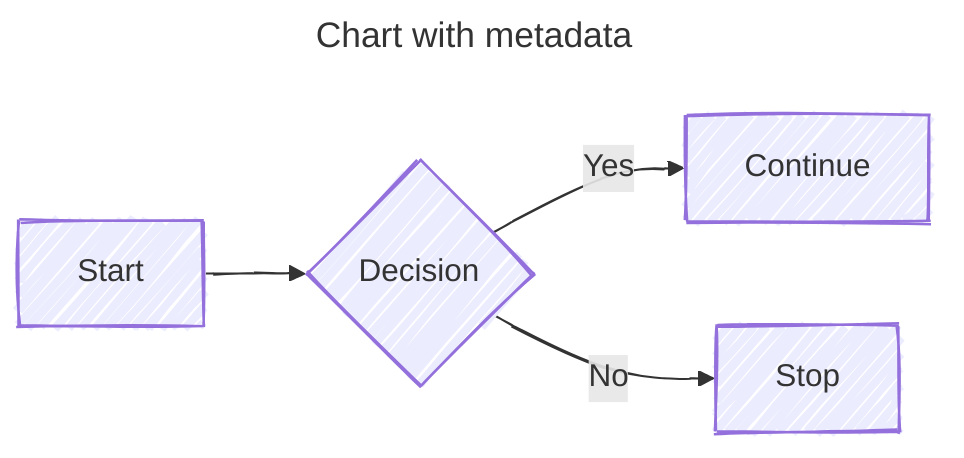

# Mermaid Learning Notes

- 官网: <https://mermaid.nodejs.cn/>
- 在线编辑器: <https://mermaid-live.nodejs.cn/>
- 用户指南: <https://mermaid.nodejs.cn/intro/getting-started.html>

References:

- <https://zhuanlan.zhihu.com/p/627356428>
- <https://zhuanlan.zhihu.com/p/719669729>
- <https://blog.csdn.net/weixin_44878336/article/details/145095671>
- <https://blog.csdn.net/qq_57508808/article/details/136110461>

## Edit and preview Mermaid chart in Markdown doc using VSCode

### Install

Install VSCode Markdown Preview Mermaid Support
<https://marketplace.visualstudio.com/items?itemName=bierner.markdown-mermaid>

## 使用图标

1. 在 settings.json 里加入图标 css 的链接：

    ``` json
    "markdown.styles": [
        "https://use.fontawesome.com/releases/v5.7.1/css/all.css"
    ]
    ```

2. 在 mermaid 中使用图标：

    ```mermaid
    graph LR
        fa:fa-check-->fa:fa-coffee
    ```

自定义图标


## 使用图片

``` mermaid
flowchart TD
    A@{ img: "https://example.com/image.png", label: "Image Label", pos: "t", w: 60, h: 60, constraint: "off" }
```

## 常用图表

### 流程图


- 第一行是图表类型声明，后面是方向
  - `TD` 表示图表方向从上到下 Top-Down
  - `LR` 表示从左到右 Left-Right
  - 还有 `TB`, `BT`, `RL`
- 节点的声明： `id[text]`，unicode 文本需要用 `""` 括起来。默认形状是矩形，还有其他形状：
  - `[]` 矩形
  - `()` 圆角矩形
  - `{}` 菱形
  - `([])` 体育场形
  - `[[]]` subroutine
  - `[()]` database
  - `(())` 圆形
  - `>]` 书签形状
  - `{{}}` 六边形
  - `[//]` `[\\]` 平行四边形
  - `[/\]` `[\/]` 梯形
  - `((()))` 双圈
- 节点之间可以链接
  - `-->` 带箭头的链接
  - `---` open link
  - `-- text ---`, `---|text|` link with text
  - `-- text -->`, `-->|text|`
  - `-.->` 虚线
  - `==>` 粗线
  - `~~~` 不可见链接，用于改变节点默认位置
  - 同一行可以有多个链接 `A -- text --> B -- text2 --> C`
  - 用 `&` 表示链接多个节点 `A & B--> C & D`
- 箭头类型
  - `<-->` 双箭头
  - `--o` 圆点
  - `--x` 叉

| 可以通过在链接定义中添加额外的破折号来要求任何链接比其他链接更长。

| 新引入的形状列表：<https://mermaid.nodejs.cn/syntax/flowchart.html#complete-list-of-new-shapes>

### 子图


### 指令

放在图表前面，用 `%%{}%%` 括起来。


### 外观


