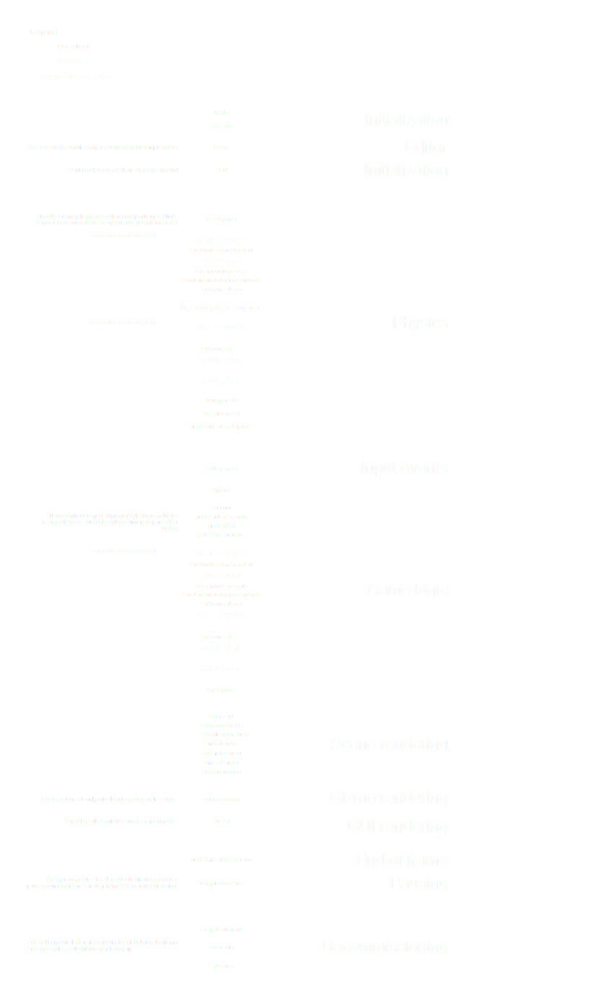
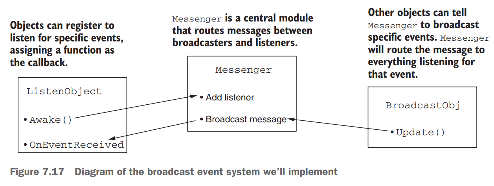
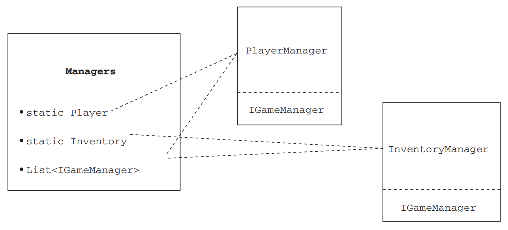

# Unity in Action: Multiplatform Game Development in C#, by Joseph Hocking, 3rd Edition (2022)

## Basics

In a component system, objects exist on a flat hierachy, and different objects have different collections of components.


All scripts that inherit from `MonoBehaviour` (base class of script components) are components. `MonoBehaviour` defines run methods such as `Start()` (called once when the object is loaded), and `Update()` (called every frame). Scripts are attached to `GameObject`, and code is written inside scripts.

Hello World Project

1. Create a new project.
2. Create a new C# script.
3. Create an empty GameObject.
4. Drag the script onto the object.
5. Add the log command to the script.
6. Click Play!

## Create a simple 2D RPG

### 1. Create project

1. Create project using "2D Core" template.
2. Add [MiniFantasy Resources](https://assetstore.unity.com/?q=minifantasy&orderBy=1) to My Assets, click Open in Unity.
3. Window -> Package Manager -> Import MiniFantasy resources -> Select Sprites only -> Import.

### 2. Create map

1. In Hierachy window, right click -> 2D Object -> Tilemap -> Rectangular, rename it as "Ground".
2. In Scene window -> Open Tile Palette -> Create New Palette -> name it as "Plains" -> Create new folder under resources and name it as "Tiles".
3. In Project window, select "Forgotten Plains" -> Sprites -> Tileset -> Tiles.
4. In Inspector, make sure Filter Mode is "Point (no filter)", and Compression is "None", click Sprite Editor -> Slice -> Grid by Cell Size -> set as 8x8 -> Slice -> Apply.
5. Drag Tiles from Project window to Tile Palette window, select "Resources/Tiles" folder. Use mouse scroll to zoom in/out, alt + drag or right mouse drag to pan.
6. Click any tile or tiles, and draw it on Scene window. U for box fill and E for erase.
7. Create another Palette of plants under "Resources/Tiles".
8. Create another Tilemap named "Plant" and drag it under "Ground", draw grass and flowers on it.
9. Create Tilemap named "Obstacle" and draw trees and rocks on it.
10. In Inspector -> Add Component -> Tilemap -> Tilemap Collider 2D.

### 3. Create actor

1. Create a new folder under "Resources" and name it as "Prefabs:.
2. Under Hierachy, create 2D object -> Sprites -> Square, name it as "Player".
3. In Inspector -> Additional Settings -> Sorting Layer -> Add Sorting Layers -> + -> name as "Player" -> change the sprite's layer to be on it.
4. In Inspector -> Sprite -> input "HumanBase" -> select a sprite.
5. Under Resources folder, create a new folder named "Scripts". Create C# script in the folder named "PlayerMovement", sample code is as below.
6. Windows -> Package Manager -> Select Unity Registry -> Search for "Input System" -> Install.
7. In Inspector, Add Component -> Physics 2D -> Rigidbody 2D, set Gravity Scale to be 0.
8. In Inspector, Add Component -> Input -> Player Input -> Create Actions -> name it as "PlayerInputActions" and use default settings.
9. In Inspector, Add Component -> Script -> Select "PlayerMovement", this link the movement script to Player sprite.

- Set sprite to be "multiple" to use a series of sprites as animation.
- Set Flip X to flip the character sprite on moving left & right.
- Use Packagae "cenamatic" for camera zooming and moving.
- Create a character and drag it to "prefab", create this character as a class, later you can create multiple instances of this character.
- Add combat animation to player sprite.
- Add collider for the weapon so it could hit the enemy sprite.
- Create an interface call IDamageable and declare OnHit method in it. Inherit and implement this interface in class DamageableCharacter, then add this class as component for player character and enemies (notice the component system difference with traditional OO inheritance).
- Add multiple animations like PlayerWalk, PlayerIdle, PlayerHit, PlayerDamage, PlayerDie, OrcHit, OrcDamage, OrcDie, etc. Specify state transition in Animator window and transition condition in Inspector window.
- In DamageableCharacter, add a method to destroy the character when it dies. In animation window, add event at last frame of orc die animation.
- Add 3D object -> Text mesh-pro and TMP essentials to draw text on screen, name it as DamagePopup and drag it to Prefabs.

``` csharp
using UnityEngine;
using UnityEngine.InputSystem;

public class PlayerMovement : MonoBehaviour
{
    Rigidbody2D rb;
    Vector2 moveInput;
    public float moveSpeed;

    private void Awake()
    {
        rb = GetComponent<Rigidbody2D>();
    }

    private void OnMove(InputValue value)
    {
        moveInput = value.Get<Vector2>();
    }

    private void FixedUpdate()
    {
        rb.AddForce(moveInput * moveSpeed);
    }
}
```

## Basic First-Person Shooter (FPS)

1. Set up the room: create the floor, outer walls, and inner walls.
2. Place the lights and camera.
3. Create the player object (including attaching the camera on top).
4. Write movement scripts: rotate with the mouse and move with the keyboard.

## 3D camera control

| Notice that Unity uses a left-handed coordinate system, as do many 3D art applications.

API References:

- MonoBehavior: <https://docs.unity3d.com/ScriptReference/MonoBehaviour.html>
- Transform: <https://docs.unity3d.com/ScriptReference/Transform.html>
- Manual: <https://docs.unity.cn/cn/2021.1/Manual/class-MonoBehaviour.html>

Scene Navigation:

- Drag to move; right click drag or Alt drag to rotate; wheel or Alt right drag to zoom
- Use the Flythrough mode to fly around the Scene view in first-person, hold right key, WASD to move left/right/forward/backward, and the Q and E keys to move up and down
- Shift click center of Gizmo to reset it to default perspective view. F to reset view on selected object.
- Ctrl+P to Exit PlayMode

Game Object Hierachy:

- You can create empty object as parent, and drag objects to link parent and chidren in the Hierachy window.
- You can change all the children as a whole by setting Transform(Position/Rotation/Scale) on the parent object.

Public variables in Script GameObjects are exposed in the Inspector, this is referred to as *serializing* the value.

## Graphics

### Texture

- Texture: 2D image being used to enhance 3D graphics.
- Supported image formats: PNG, JPG, GIF, BMP, TGA, TIFF, PICT, PSD
- Recommended formats: PNG, TGA
- Useful resources: <http://www.textures.com>
- Tips: The size (in pixels) of a texture should be in powers of 2, like 256, 512, etc.

Actions

1. Import an image as texture: drag an image file to Project view -> Assets/Textures, or right click and Import New Asset.
2. Apply texture to 3D object: drag text from Project view onto an object in the scene (auto create material), or in Project view ->  Assets, Create -> Material, drag texture into material Albedo property.
3. Create Skybox material: Assets -> Create -> Material, Shader -> Skybox/6 Sided, change Assets/Texture Skybox Wrap Mode to Clamp (default Repeat).
4. Set Skybox: Window -> Rendering -> Lighting, Environment -> Skeybox Material.

### 3D models

- Tools: Maya, 3DS Max, Blender(open source)
- Models: Unity Asset Store: <https://assetstore.unity.com>
- Supported 3D model formats: FBX(recommended), OBJ, COLLADA(DAE), 3DS, DXF, maya, blender, gITF(via UnityGLTF add-on)

Import Tips:

- Default Scale Factor is too small, suggest to set to 50
- Check Generate Collider
- Uncheck Import Animation unless you need it

### Particle Systems

GameObject -> Effects -> Particle System

### 2D Graphics

Sprites: 2D images displayed directly on the screen (comparing to textures that displayed on 3D models)

Tools for packing multiple sprites to one sprite sheet (sprites atlases): TexturePacker, Unity Sprite Packer (In Project Settings)

2D Camera:

- In 2D Editor, Z value is for stacking (lower Z on top, background should be highest)
- Default Pixels Per Unit is 100, meaning 1 pexel for 0.01 units.
- Projection should be Orthographic
- Clear Flags (camera background) is Solid Color
- Set Size to be SCREEN_SIZE / 2 / PIXELS_PER_UNIT, will get pixel-perfect graphics.

Use TextMeshPro package for on screen text display.

## Script Events Lifecycle

- Initialization
  - Awake
  - OnEnable, called when hidden object becomes visible again
  - Reset
  - *Start*, only called once for a given script
- Physics
  - FixedUpdate
  - OnTriggerXXX
  - OnCollisionXXX
  - yield WaitForFixedUpdate
- Input Events
  - OnMouseXXX
- Game Logic
  - *Update*
  - yield null
  - yield WaitForSeconds
  - yield WWW
  - yield StartCoroutine
  - LateUpdate
- Scene Rendering
  - OnPreCull
  - OnBecameVisible
  - OnWillRenderObject
  - OnPreRender
  - OnRenderObject
  - OnPostRender
  - OnRenderImage
- GUI
  - OnGUI
  - yieldWaitForEndOfFrame
- Teardown
  - OnDisable
  - OnDestroy
  - OnApplicationQuit

Reference:

- <https://docs.unity3d.com/Manual/ExecutionOrder.html>
- <https://docs.unity.cn/cn/2021.3/Manual/ExecutionOrder.html>
- Flow Chart
  

## 2D physics

Difference between Collider and Rigidbody:

- Collider 2D: defines the shape for physics to act on.
- Rigidbody 2D: tells the physics simulation what object to act on.

Resources:

- Unity tilemap system: Window -> Package Manager -> 2D Tilemap Editor
- Doc: <https://docs.unity3d.com/Manual/class-Tilemap.html>
- External library: SuperTiled2-Unity <https://www.seanba.com/supertiled2unity>
- Image courtesy of Tiled: <https://www.mapeditor.org>
- Open Game Art: <https://lpc.opengameart.org>

## Game GUI

- Heads Up Display (HUD): additional overlay text and buttons on top of game view.
- Immediate mode system: explicitly issuing drawing commands every frame. (OnGUI method)
- Retained mode system: defining all the visuals once, and then for every frame.

> All HUD images must be attached to a canvas object

To import a TrueType font with TextMeshPro, first import the font into Unity and then choose Window -> TextMeshPro -> Font Asset Creator.

To add Click event handler on an HUD button.

1. Create a GameObject named GameController, create a script called UIController.cs and attach to it, and add public method in UIController called OnOpenSettings;
2. In Unity Editor, select the Settings button object, in Inspector On Click() event handler list, click +;
3. Drag GameController in the controller slot, then select the OnOpenSettings method;

> Important! When linking event handlers to HUD controls, remember to choose the function under **`Dynamic Float`** (upper in popup), and **not `Static Parameter`**, in the latter case it will receive only a single value preset in editor.

To interact with other mouse events, use an EventTrigger component.

Saving settings between plays by using PlayerPrefs (small amount of data)

``` csharp
using UnityEngine.UI;
[SerializeField] Slider speedSlider;
// get saved value
speedSlider.value = PlayerPrefs.GetFloat("speed", 1);
// save value
PlayerPrefs.SetFloat("speed", speed);
```



### Lights and Shadows

- Light Map: textures applied to the level geometry, with pictures of the shadows baked into the texture image.
- Baking the shadow: drawing shadows onto a model's texture is referred to as baking the shadows.
- Culling mask: set of objected that we want to remove from shadow casting.
- Skeletal animation: a series of bones setup inside the model, when bones move, the model's surface linked to bones moves along.
- Mecanim: Unity system for managing animations on models.
- Tween: code commands that cause object to move around.

Refer to Cinemachine package (Window -> Package Manager -> Cinemachine) for more advanced camera control tools.

Make skeletal animation:

1. define animation clips in the imported model file;
2. set up controller to play those animation clips;
3. incorporate the animation controller in code.

| Tips: You can use Dot production to check if two vector are of same direction, for example:

``` csharp
// check if target object is 'facing' the direction
if (Vector3.Dot(transform.forward, direction.normalized) > .5f) { ... }
```

Tips: When setting an object to be trigger object, remember to:

1. In Inspector -> Box Collider, check 'Is Trigger';
2. In Inspector top right, set the layer to be 'Ignore Raycast';
3. In Inspector -> Mesh Renderer -> Lighting -> turn off 'Cast Shadows';

## Manage inventory

Tips:

1. Drag GameObject from Hierarchy view to Project view will turn it into a prefab. Then we can create multiple instances from a Prefab. In this we could create collectable items (like keys, engery, health) easily.
2. To use MVC pattern for game status management, create an Interface `IGamgeManager`, then managers like `InventoryManager` and `PlayerManager` which inherit from the interface, then create a centralized `Managers` to manage all managers (see diagram below);
3. Use built-in `StartCoroutine` method to call other long-running data loading methods asynchronously (see sample code below), so that UI animation won't stuck on startup.
4. Assets placed into the Resources folder can be loaded in code using `Resources.Load()` method;



``` csharp
StartCoroutine(StartupManagers()); // call StartupManagers asynchronously
```

## Sound effects and music

Supported Audio File Formats: WAV, AIF(Mac), MP3, OGG, MOD, XM
Tool to create sound files: Audacity
Free sound clips: <www.freesound.org>

Tips:

- Load in Background and Preload Audio Data settings balance playback performance and memory usage, don't preload long audio clip.
- 3D sounds have specific location within the simulation. Their volume and pitch are influenced by the movement of the listener.

### Audio Components

- AudioClip: the sound file, like CD
- AudioSource: play the source, like CD player
- AudioListener: receiver in game, like the user controlled character (on the default camera)
- AudioMixer(optional): process audio signals and apply various effects

Tips: You can create a centralized AudioManager to control the volume and mute all if needed, it is implemented using global values on `AudioListener`. The `AudioListener` class can modulate the volume of all sounds received by all `AudioListener` instances.

``` csharp
public class AudioManager : MonoBehaviour, IGameManager
{
    public float soundVolume
    {
        get { return AudioListener.volume; }
        set { AudioListener.volume = value; }
    }
    public bool soundMute
    {
        get { return AudioListener.pause; }
        set { AudioListener.pause = value; }
    }
    //...
}
```

### Music

- Normally, Unity loads all assets in a scene as soon as the scene loads, but assets from `Resources` aren't loaded until the code manually fetches them. In this case, we want to lazy-load the audio clips for music.
- For music clips, we would like to set:
  - `Load Type` as `Streaming`
  - `Compression Format` to be `Vorbis`
- For music `AudioSource`:
  - `Play On Awake`: false
  - `Loop`: true
  - `Priority` set to a lower value (higher priority)

### Path Finding Algorithm

1. Unity built-in pathfinding solution `NavMesh`. Now included in `AI Navigation` package: <https://docs.unity3d.com/Packages/com.unity.ai.navigation@1.1/manual/index.html>
2. Free `A* Pathfinding` Project: <https://arongranberg.com/astar/>

### Saving and Loading Data

- Save small amount of settings: `PlayerPrefs`
- Save user data (game progress, inventory): `System.IO`

``` csharp
// read from PlayerPrefs to display on UI
speedSlider.value = PlayerPrefs.GetFloat("speed", 1);
// save setting
PlayerPrefs.SetFloat("speed", speed);

// save game state object to binary file
using (FileStream stream = File.Create(filename))
{
    BinaryFormatter formatter = new BinaryFormatter();
    formatter.Serialize(stream, gamestate);
}

// load game state
using (FileStream stream = File.Open(filename, FileMode.Open))
{
    BinaryFormatter formatter = new BinaryFormatter();
    gamestate = formatter.Deserialize(stream) as Dictionary<string, object>;
}
```

<!--
TODO: unfinished below here

## Deploy to desktop, web, or mobile

-->
